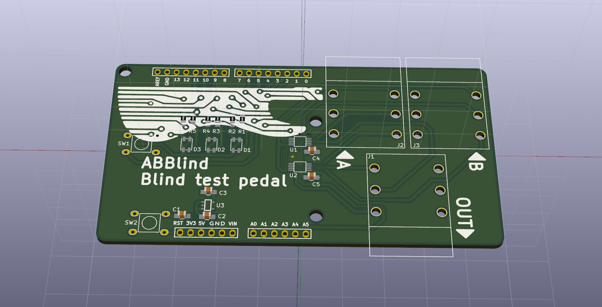
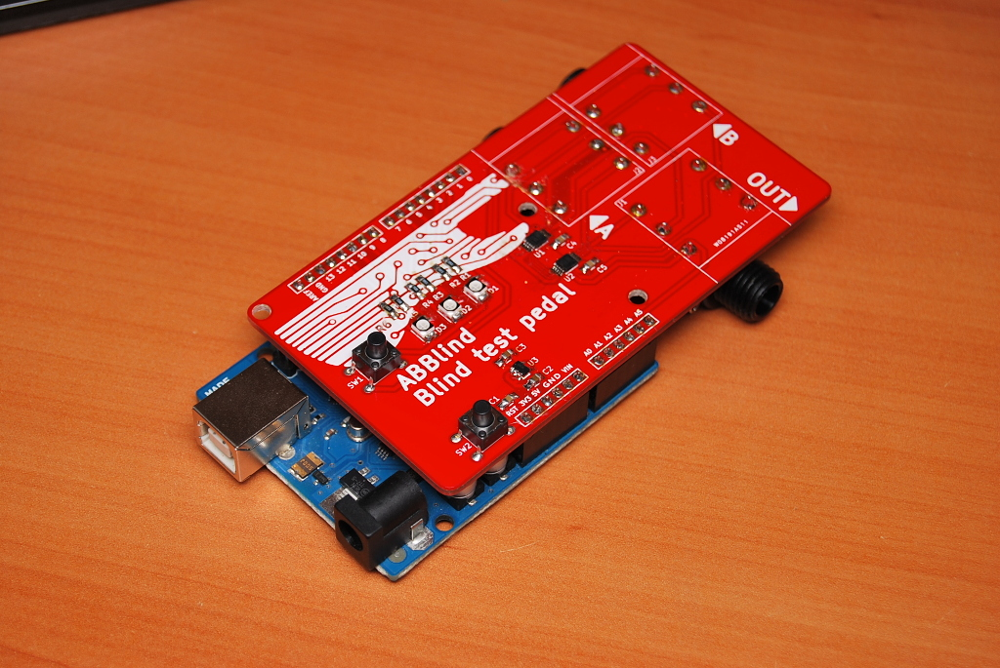
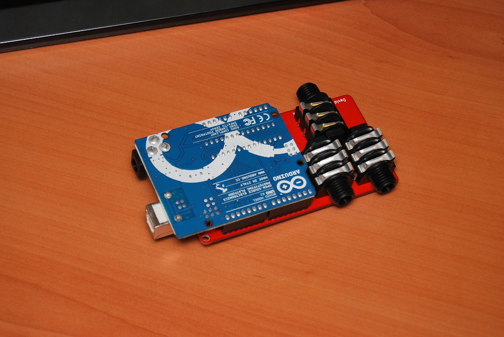
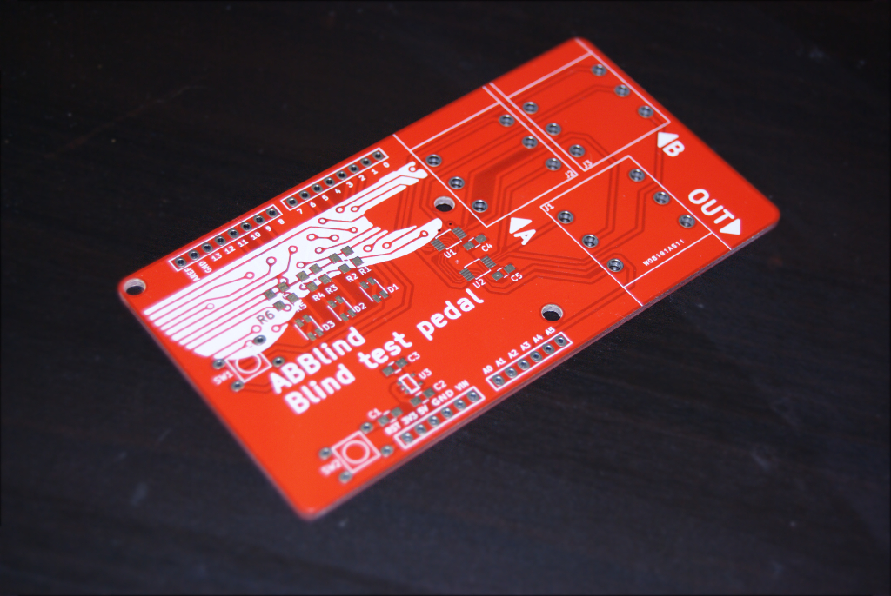

ABBlind
--------------------------

Device to make random blind tests to audio equipment.

Why to spend lots of money in audiophile quality devices when you cannot tell the different from a more affordable device? ABBlind allows you to make blind tests for you to try to distinguish between two audio devices. It will randomly present you channels A and B, without telling you which channel are you listening to until you have heard three samples. Then, it will tell you in which order you listened to devices A and B.

As it is based on Arduino, you can modify ABBlind to add custom testing modes and more functionality.

## v0.1 Prototype
### Assembled

### PCBs

# Credits
* Author: [David Estevez Fernandez](https://github.com/David-Estevez)
